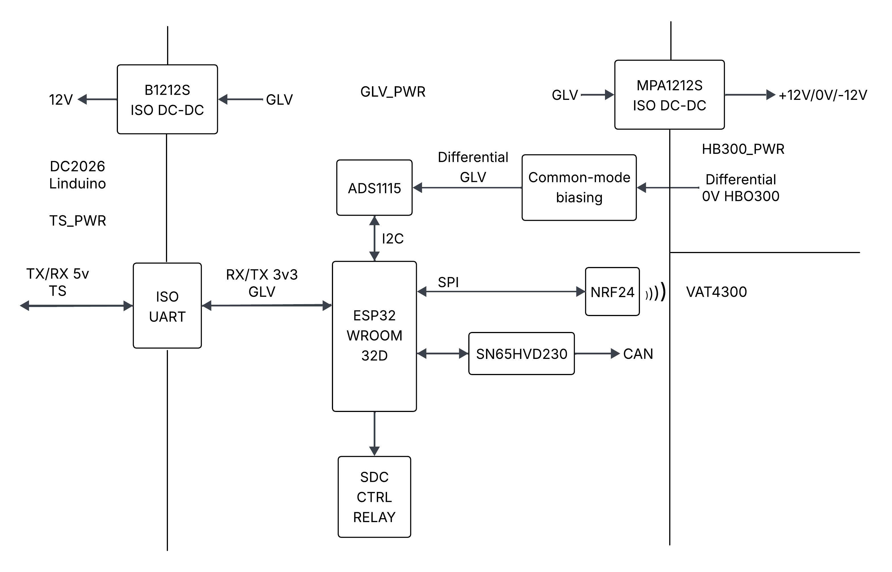

# Battery Management System (BMS)

---

## Architecture evolution

### Earlier version
- Used **LTC6804-based slave boards (DC1894B)** with a **Linduino (DC2026)** as the isoSPI master.
- The entire system ran on the **ATmega328P** on the DC2026.
- SRAM was very limited (~2 KB), which was barely enough for:
  - 72× cell voltages
  - SOC variables
  - filtering / fault flags
- This became the main bottleneck as features were added.

---

### Revised architecture
- High-level processing was offloaded to an **ESP32**.
- The **DC2026** was retained only for reliable LTC6804 isoSPI communication.
- Direct isoSPI from the ESP32 was avoided to keep hardware and isolation simpler.

---

## Communication and isolation
- **ESP32** is referenced to **GLV**.
- **Linduino (DC2026)** is referenced to **TS**.
- Communication between the two is via an **isolated UART**.

---

## Additional features
- CAN communication for vehicle integration.
- Redundant current sensing:
  - Hall-effect sensor
  - Shunt-based sensor

